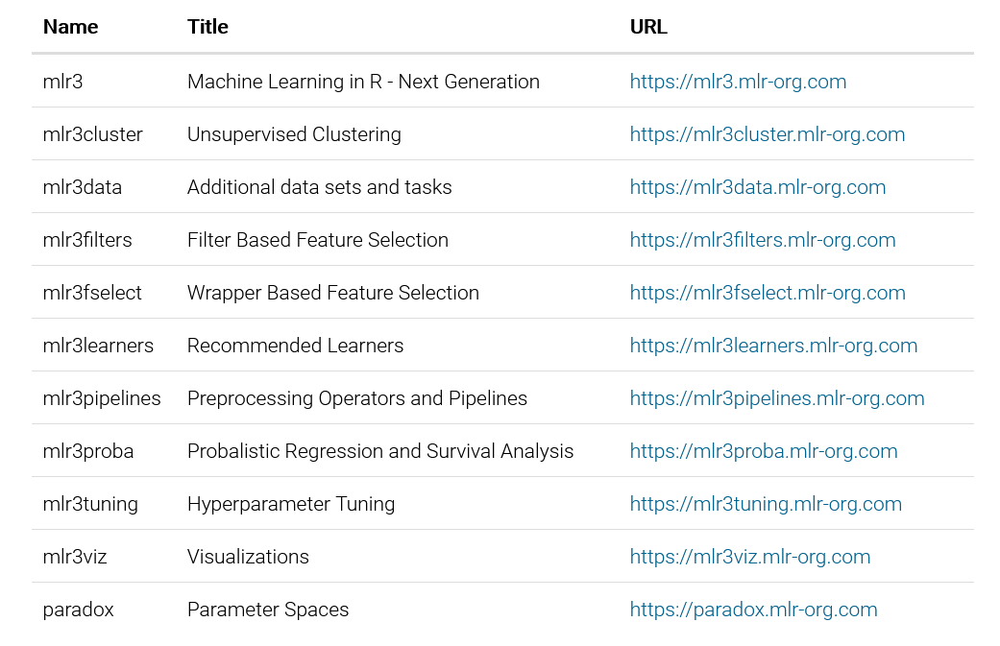

---
output:
  revealjs::revealjs_presentation:
    transition: slide
    self_contained: true
    css: white-helv.css
    highlight: default
    fig_height: 4
    reveal_options:
      slideNumber: 'c/t'
      previewLinks: true

---

```{r, echo = FALSE}
library(knitr)
```


# Машинное обучение с использованием пакета mlr3

© Андрей Огурцов


## План

1. Обзор ML-фреймворков на R

2. Экосистема mlr3

3. Основные составляющие ML-пайплайна в mlr3

4. Пайпы и графы

5. Пример решения реальной задачи с использованием GPU-версии `xgboost` внутри mlr3

6. Полезные ссылки

7. Вопросы и ответы


## ML-фреймворки на R

1. **mlr3: `mlr3`+`mlr3pipelines`+`mlr3learners`+`mlr3tuning`+`mlr3measures`+...**

Очень похож на `scikit-learn`

В основе лежат R6-классы, в качестве бекенда по умолчанию для табличных данных используется `data.table`

Все процессы построения моделей объединены в граф вычислений

2. **tidymodels: `rsample`+`recipes`+`parsnip`+`tune`+`yardstick`+...**

Построен вокруг функций, а не объектов с методами, как mlr3 (но есть конвергентное сходство с mlr3)
  
3. **(2.5) H2O**

Не совсем фреймворк и не совсем на R


##  Экосистема mlr3


*Source: https://mlr3book.mlr-org.com/introduction.html*


##  Экосистема mlr3 (продолжение)



*Source: https://mlr3verse.mlr-org.com/*


##  Экосистема mlr3 (продолжение)

```{r, message=FALSE}
library(mlr3verse)
```

Дополнительные пакеты:

* Analysis of benchmark experiments: `mlr3benchmark`

* Task interface for data bases: `mlr3db`

* Connector to OpenML: `mlr3oml`

* Additional learners: `mlr3extralearners`

* Hyperband tuning algorithm: `mlr3hyperband`

* Spatio-temporal resampling: `mlr3spatiotempcv`

* etc.


## Основные составляющие ML-пайплайна 


*Source: https://mlr3book.mlr-org.com/optimization.html*


## Основные составляющие ML-пайплайна (продолжение)

```{r}
# Задача
data("Sonar", package = "mlbench")
task <- TaskClassif$new(id = "Sonar", backend = Sonar, 
                        target = "Class")
task <- as_task_classif(Sonar, target = "Class", 
                        positive = "M")
task
```


## Основные составляющие ML-пайплайна (продолжение)

```{r}
# Модель
learner_rpart <- LearnerClassif$new("classif.rpart")
learner_rpart <- mlr_learners$get("classif.rpart")
learner_rpart <- lrn("classif.rpart", 
                     predict_type = "prob", 
                     minsplit = 50)
learner_rpart$param_set$values$minsplit <- 33 #insert_named()
learner_rpart
```


## Основные составляющие ML-пайплайна (продолжение)


```{r}
# Обучение
learner_rpart$train(task, row_ids = 1:120) 
learner_rpart$model
```


## Основные составляющие ML-пайплайна (продолжение)

```{r}
# Предсказание на новых данных
preds <- learner_rpart$predict_newdata(newdata = Sonar)
preds
```


## Основные составляющие ML-пайплайна (продолжение)

```{r}
# Кросс-валидация
cv3 <- rsmp("cv", folds = 3)
resample_results <- resample(task, learner_rpart, cv3)
resample_results
```


## Пайпы и графы

```{r}
pca <- po("pca")
filter <- po("filter", 
             filter = mlr3filters::flt("variance"), 
             filter.frac = 0.5)
learner_po <- po("learner", 
                 learner = lrn("classif.rpart"))
graph <- pca %>>% filter %>>% learner_po
graph$plot()
```


## Пайпы и графы (продолжение)

```{r}
library(data.table)
library(mlr3verse)

dt <- data.table(
  x = factor(c(1:3, 3), levels = 1:3), y = 1
)
dt_test <- data.table(
  x = factor(c(1:3, 3, 4), levels = 1:4), y = 1
)
task <- TaskRegr$new("y", backend = dt, 
                     target = "y")
task_test <- TaskRegr$new("y_test", backend = dt_test, 
                          target = "y")
```


## Пайпы и графы (продолжение)

```{r}
g <- po("fixfactors") %>>%
  po("imputeoor", affect_columns = selector_all())
g$train(task)

g$predict(task_test)$imputeoor.output$data()
```


## Пайпы и графы (продолжение)

```{r}
g <- po("imputeoor") %>>%
  po("fixfactors")
g$train(task)
g$predict(task_test)$fixfactors.output$data()
```


## Пайпы и графы (продолжение)

```{r}
g <- po("fixfactors") %>>%
  po("imputemode")
g$train(task)
g$predict(task_test)$imputemode.output$data()
```

## Полезные ссылки

* Учебник от разработчиков https://mlr3book.mlr-org.com/index.html

* Шпаргалка https://cheatsheets.mlr-org.com/mlr3.pdf

* Галерея примеров https://mlr3gallery.mlr-org.com/

* Слегка устаревший хабрапост https://habr.com/ru/company/ods/blog/491566/

* Коннектор к `torch` с реализацией сети tabnet https://github.com/mlr-org/mlr3torch 

* Интерпретация моделей mlr3 https://cran.r-project.org/web/packages/flashlight/vignettes/mlr3.html


## Вопросы


## Спасибо за внимание!

Презентация создана при помощи **revealjs**

[https://github.com/statist-bhfz/ml_mlr3](https://github.com/statist-bhfz/ml_mlr3)